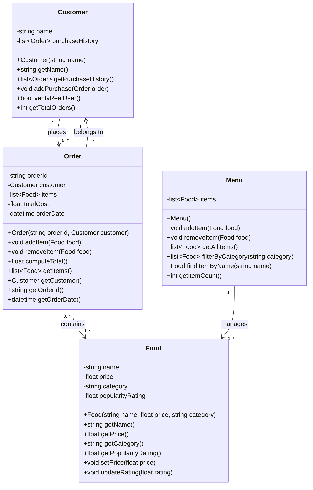

# ByteBites Revised Class Diagram

## Design Rationale

### Customer Class
- Tracks `name` for customer identification
- `purchaseHistory` list maintains all past orders for verification
- `verifyRealUser()` method checks purchase history to confirm real users
- `addPurchase()` maintains the history when new orders are placed

### Food Class
- Includes all required attributes: `name`, `price`, `category`, `popularityRating`
- `updateRating()` allows dynamic adjustment of popularity
- Getters provide access to immutable attributes

### Menu Class
- `items` collection holds all available food items
- `filterByCategory()` enables filtering by categories like "Drinks", "Desserts"
- `findItemByName()` supports item lookup
- Acts as a container/manager for all Food items

### Order Class
- Groups selected items in the `items` list
- `computeTotal()` calculates total cost from all items
- Links to the `customer` who placed the order
- `orderId` and `orderDate` provide transaction tracking

## Relationships
- **Customer ↔ Order**: One-to-many bidirectional (each customer can have multiple orders, each order belongs to one customer)
- **Order → Food**: Many-to-many (orders contain multiple food items, food items can appear in multiple orders)
- **Menu → Food**: One-to-many composition (menu manages the collection of all food items)

This design satisfies all spec requirements while maintaining clean object-oriented principles.
