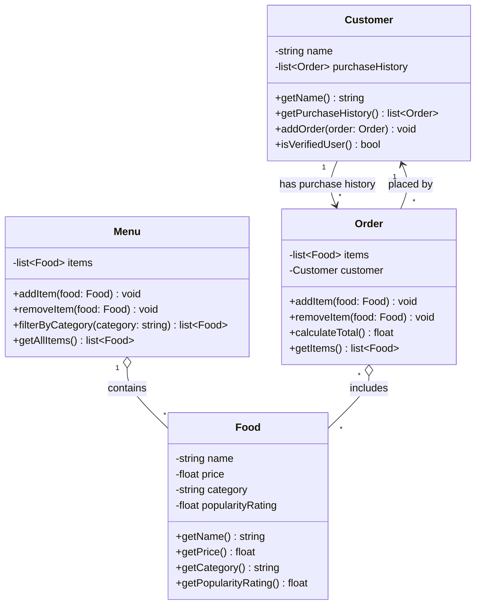

# ByteBites Class Diagram

```mermaid
classDiagram
    class Customer {
        -string name
        -list~Order~ purchaseHistory
        +getName() string
        +getPurchaseHistory() list~Order~
        +addOrder(order: Order) void
        +isVerifiedUser() bool
    }
    
    class Food {
        -string name
        -float price
        -string category
        -float popularityRating
        +getName() string
        +getPrice() float
        +getCategory() string
        +getPopularityRating() float
    }
    
    class Menu {
        -list~Food~ items
        +addItem(food: Food) void
        +removeItem(food: Food) void
        +filterByCategory(category: string) list~Food~
        +getAllItems() list~Food~
    }
    
    class Order {
        -list~Food~ items
        -Customer customer
        +addItem(food: Food) void
        +removeItem(food: Food) void
        +calculateTotal() float
        +getItems() list~Food~
    }
    
    Customer "1" --> "*" Order : has purchase history
    Menu "1" o-- "*" Food : contains
    Order "*" --> "1" Customer : placed by
    Order "*" o-- "*" Food : includes
```
